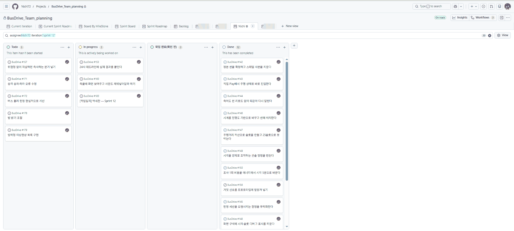
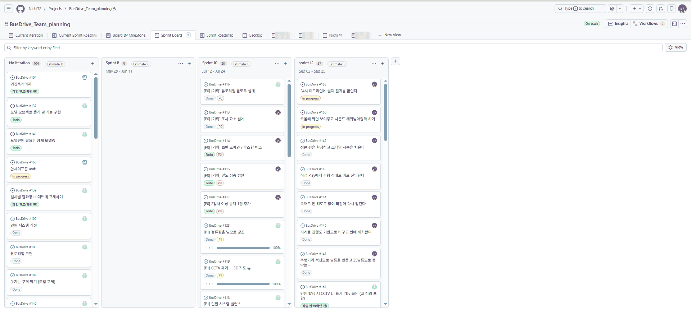
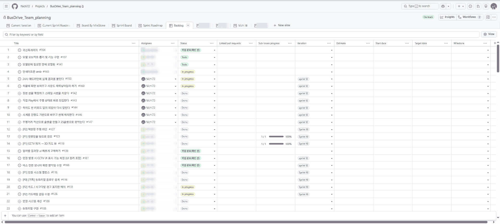
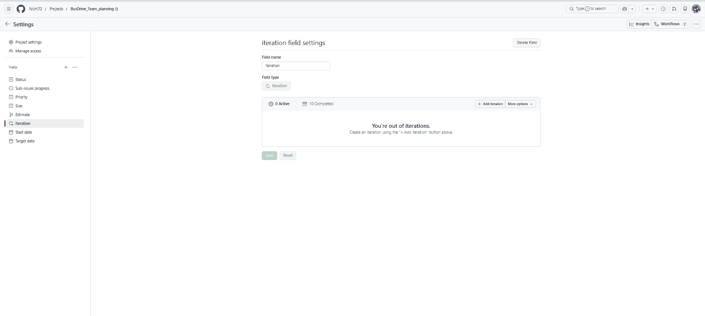
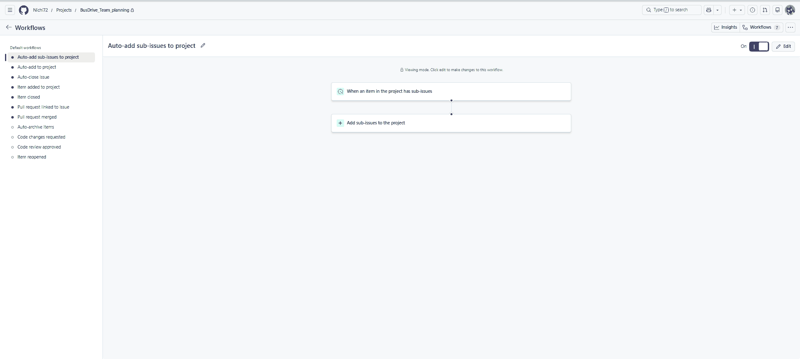
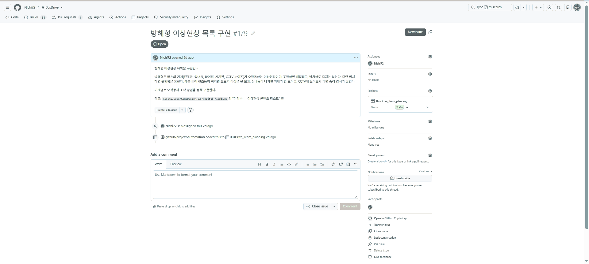
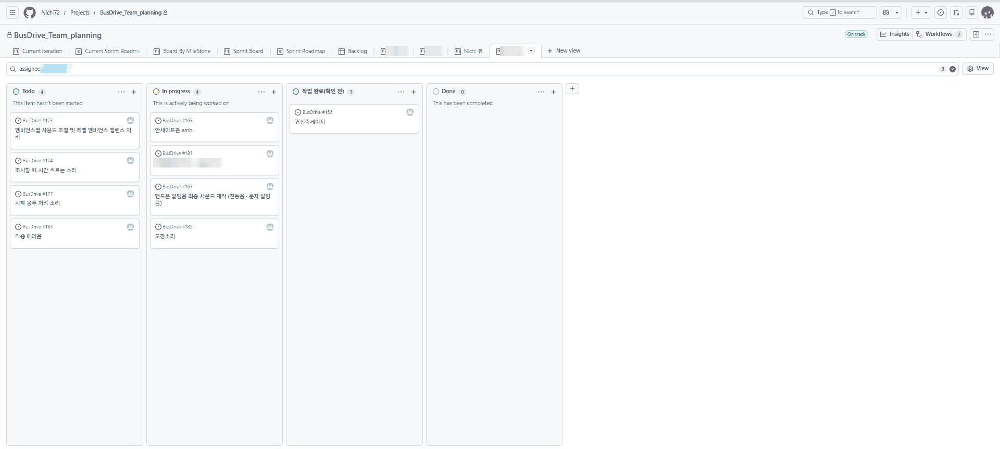
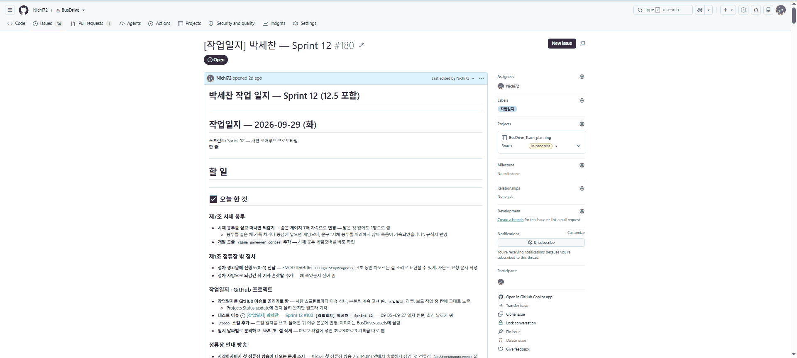

# 애자일 개발론

> 관련 문서: [효율적인 실무적 게임 프로젝트 관리 방법](0_%ED%9A%A8%EC%9C%A8%EC%A0%81%EC%9D%B8%20%EC%8B%A4%EB%AC%B4%EC%A0%81%20%EA%B2%8C%EC%9E%84%20%ED%94%84%EB%A1%9C%EC%A0%9D%ED%8A%B8%20%EA%B4%80%EB%A6%AC%20%EB%B0%A9%EB%B2%95.md)

## 목차
1. 왜 게임 개발에 애자일인가 (워터폴과 비교)
2. 애자일의 핵심 가치 (애자일 선언문)
3. 스크럼 (역할, 스프린트와 이벤트, 산출물)
4. 칸반 (보드, WIP 제한)
5. 스크럼과 칸반 비교: 우리 팀은 무엇을 쓸까
6. 게임 특화 실천법 (프로토타이핑, 플레이테스트, 버티컬 슬라이스, 마일스톤)
7. 우리 팀 운영 규칙 (실무 가이드)

---

## 1. 왜 게임 개발에 애자일인가

### 워터폴(Waterfall)
요구사항 → 설계 → 구현 → 테스트 → 출시를 **순서대로 한 번씩** 진행한다.
앞 단계가 끝나야 다음 단계로 넘어간다.
- 장점: 일정과 비용을 예측하기 쉽고, 문서가 잘 남는다.
- 단점: 문제를 늦게 발견하면 되돌리는 비용이 크고, 완성 직전까지 결과물을 직접 확인하기 어렵다.

### 애자일(Agile)
짧은 주기(보통 1~4주)마다 **계획 → 만들기 → 확인 → 개선**을 반복한다.
매 주기가 끝날 때마다 실제로 동작하는 결과물이 나온다.

| 구분 | 워터폴 | 애자일 |
|---|---|---|
| 진행 방식 | 단계별 순차 진행 | 짧은 주기 반복 |
| 기획 변경 | 어렵고 비용이 큼 | 주기마다 반영 |
| 결과 확인 시점 | 프로젝트 막바지 | 매 주기 |
| 잘 맞는 경우 | 요구사항이 명확하고 고정됨 | 요구사항이 불확실하고 자주 바뀜 |

### 게임은 왜 애자일을 선호하는가
게임에서 가장 큰 가치는 **"재미"**다. 재미는 기획서로 증명할 수 없고 직접 플레이해 봐야 안다.
→ 기획 변경이 매우 많고 결과를 예측하기 어렵다.
→ 작게 만들고, 플레이해 보고, 고치는 애자일 방식이 맞다.

> 실무에서는 순수 애자일보다 **하이브리드**가 많다.
> 출시일이나 마일스톤 같은 큰 틀은 워터폴처럼 고정하고, 그 안의 작업은 애자일로 반복한다.

---

## 2. 애자일의 핵심 가치 (애자일 선언문)

2001년 개발자 17명이 발표한 「애자일 소프트웨어 개발 선언」이 애자일의 출발점이다.
스크럼, 칸반 등 모든 애자일 기법은 아래 4가지 가치를 바탕으로 한다.

| 더 중요하게 여긴다 | 보다 |
|---|---|
| 개인과 상호작용 | 프로세스와 도구 |
| 동작하는 소프트웨어 | 포괄적인 문서 |
| 고객과의 협력 | 계약 협상 |
| 변화에 대응하기 | 계획을 따르기 |

> 오른쪽 항목도 가치가 있지만, 왼쪽 항목을 **더** 중요하게 여긴다는 뜻이다. 오른쪽을 버리라는 말이 아니다.

### 게임 개발로 바꿔 읽으면
- **개인과 상호작용**: 툴이나 규칙보다 팀원끼리 바로 소통하는 게 우선이다. (디스코드 화면 공유)
- **동작하는 소프트웨어**: 기획서보다 플레이할 수 있는 빌드가 우선이다. 재미는 플레이해 봐야 안다.
- **고객과의 협력**: 플레이어와 테스터의 피드백을 개발 중에 계속 반영한다.
- **변화에 대응하기**: 재미없으면 원인 분석을 통해 기획을 변경한다. 처음 계획을 지키는 것보다 중요하다.

## 3. 스크럼(Scrum)

스크럼은 애자일을 실천하는 **프레임워크**(팀 운영 방식 전체)다.
**스프린트**는 스크럼 안의 반복 주기(1~4주)이고, 스크럼의 이벤트 중 하나다.
→ "스크럼 = 스프린트"가 아니라 "스크럼 ⊃ 스프린트"

### 역할 (3)
| 역할 | 하는 일 | 게임 팀에서는 |
|---|---|---|
| 프로덕트 오너(PO) | 무엇을 만들지 정하고 우선순위를 매긴다 | 팀장 |
| 스크럼 마스터(SM) | 스크럼이 잘 돌아가게 돕고 방해 요소를 치운다 | PM (없으면 기획자) |
| 개발자 | 실제로 만든다 (기획·아트·프로그래밍 모두 포함) | 팀원 전원 |

> 실무에서는 **팀장이 PO와 스크럼 마스터를 모두 맡는 경우**가 많다.
> 스크럼 마스터는 별도의 **PM**이 맡는 게 이상적이지만, PM이 없는 팀에서는 **기획자**가 맡는 경우가 많다.

### 이벤트 (5)
1. **스프린트**: 1~4주 고정 주기. 아래 이벤트가 전부 이 안에서 일어난다.
2. **스프린트 플래닝**: 이번 스프린트에 무엇을 할지 정한다.
3. **데일리 스크럼**: 매일 15분. 어제 한 일, 오늘 할 일, 막힌 점을 공유한다.
4. **스프린트 리뷰**: 만든 결과물을 시연한다. 게임에서는 **빌드를 직접 플레이**한다.
5. **스프린트 회고**: 일하는 방식에서 잘된 점과 고칠 점을 정리한다.

### 산출물 (3)
- **프로덕트 백로그**: 앞으로 만들 기능 전체 목록 (우선순위순)
- **스프린트 백로그**: 이번 스프린트에서 할 작업 목록
- **증분(Increment)**: 스프린트가 끝날 때 나오는, 동작하는 결과물 (플레이 가능한 빌드)

## 4. 칸반(Kanban)

칸반은 도요타 생산 방식에서 나온 기법으로, **작업 흐름을 눈에 보이게** 만들어 관리한다.
스크럼과 달리 **스프린트(고정 주기)가 없고**, 일이 끊김 없이 계속 흘러간다.

### 칸반 보드
| 할 일 (To Do) | 진행 중 (Doing) | 검토 (Review) | 완료 (Done) |
|---|---|---|---|
| 몬스터 AI 기획 | 플레이어 이동 구현 | 메인 UI 시안 | 타이틀 화면 |

- 작업 하나를 카드 하나로 만들고, 진행 상황에 따라 오른쪽으로 옮긴다.
- 누가 무엇을 하는지, 어디서 막혔는지 한눈에 보인다.

### 핵심 규칙: WIP 제한
- WIP(Work In Progress) = 동시에 진행 중인 작업 수
- "진행 중" 칸에 올릴 수 있는 카드 수를 제한한다. (예: 1인당 2개)
- 일을 여러 개 벌려 놓고 하나도 못 끝내는 상황을 막는다. → **"시작하기보다 끝내기"**

### 게임 팀에서 잘 맞는 경우
- 버그 수정, QA 대응, 라이브 서비스 운영처럼 **일이 예측 없이 계속 들어오는 업무**
- 아트 리소스 제작처럼 **흐름이 일정한 반복 작업**

### 우리 팀 도구: 깃허브 Projects
칸반 도구는 Notion, Trello, Jira 등 여러 가지가 있지만, 우리 팀은 **깃허브 Projects**를 주로 사용한다.
깃허브 Projects 하나로 **스크럼과 칸반을 모두** 운영할 수 있다.

| 용도      | 깃허브 Projects 기능                                |
| ------- | ---------------------------------------------- |
| 칸반 보드   | **Board** 보기 (Status 필드로 열 구분, 열마다 카드 수 제한 가능) |
| 스프린트    | **Iteration** 필드 (1~4주 주기 설정, 이슈를 스프린트에 배정)    |
| 백로그     | **Table** 보기 (우선순위·담당자·스프린트별 정렬·필터)            |
| 마일스톤 일정 | **Roadmap** 보기 (타임라인)                          |
|         |                                                |

- 작업 카드 = 깃허브 **이슈**라서, 커밋·PR과 바로 연결된다.

#### 실제 사용 예시 (BusDrive 프로젝트)

**칸반 보드 (Board 보기)**: Status별로 카드를 옮긴다. `Todo → In progress → 작업 완료(확인 전) → Done`

**스프린트 보드 (Iteration별 Board)**: 같은 이슈를 스프린트 단위로 묶어서 본다.

**백로그 (Table 보기)**: 담당자·Status·Iteration을 한 표에서 관리한다.

**Iteration 필드 설정**: 프로젝트 설정 → Fields → iteration에서 스프린트 주기를 만든다.

**Workflows (자동화)**: 이슈 추가, 닫힘, PR 병합 시 Status를 자동으로 바꾼다.

## 5. 스크럼과 칸반 비교: 우리 팀은 무엇을 쓸까

| 구분 | 스크럼 | 칸반 |
|---|---|---|
| 주기 | 스프린트(1~4주) 고정 | 없음, 계속 흐름 |
| 계획 시점 | 스프린트 시작할 때 | 필요할 때마다 |
| 중간 변경 | 스프린트 중에는 지양 | 언제든 가능 |
| 역할 | PO, 스크럼 마스터, 개발자 | 정해진 역할 없음 |
| 핵심 지표 | 스프린트당 완료량 | 작업 하나가 끝나는 데 걸린 시간 |
| 잘 맞는 일 | 새 기능 개발 | 버그·QA·운영처럼 수시로 들어오는 일 |

### 우리 팀: 스크럼반(Scrumban)
둘 중 하나만 고르지 않고 섞어서 쓴다.
- **기능 개발**은 스크럼으로: 스프린트 단위로 계획하고, 끝나면 빌드를 플레이하며 리뷰한다.
- **진행 관리**는 칸반 보드로: 스프린트 안의 작업을 Board에서 To Do → Done으로 옮기고, WIP를 제한한다.
- **버그·긴급 이슈**는 스프린트와 상관없이 칸반으로 바로 처리한다.

→ 깃허브 Projects 하나에서 Iteration(스크럼)과 Board(칸반)를 같이 쓴다.

## 6. 게임 특화 실천법

### 6-1. 마일스톤: 큰 틀은 단계로 나눈다 (하이브리드의 "워터폴" 부분)
| 단계     | 목표              | 끝났다는 기준             |
| ------ | --------------- | ------------------- |
| 컨셉     | 무엇을 만들지 정한다     | 컨셉 문서, 핵심 재미 한 줄 정의 |
| 프리프로덕션 | 재미를 검증한다        | 프로토타입, 버티컬 슬라이스     |
| 프로덕션   | 콘텐츠를 양산한다       | 모든 기능 구현            |
| 알파     | 처음부터 끝까지 플레이 가능 | 전체 플레이 가능 (퀄리티는 미완) |
| 베타     | 다듬기, 버그 잡기      | 새 기능 추가 중단, 콘텐츠 완성  |
| 출시     | 배포              | 출시 빌드               |

각 단계 안에서는 스프린트를 반복한다.

> 위 표는 교과서적인 구분이다. 실무나 소규모 프로젝트에서는 **상황에 맞게 일부 단계를 생략하거나 합친다.**
> (예: 컨셉을 프리프로덕션에 포함, 알파와 베타를 하나로 묶기)
> 단, **"재미 검증(프리프로덕션) → 양산(프로덕션) → 다듬기(베타)"** 흐름은 유지한다.

### 6-2. 프로토타이핑: 재미부터 확인한다
- 그래픽 없이 박스와 임시 리소스(그레이박스)로 **핵심 재미(코어 루프)**만 빠르게 만든다.
- 목적은 "이게 재미있는가?"를 확인하는 것. 프로토타입 코드는 버려도 된다.
- 재미없으면 원인을 분석해서 바꾸고 다시 만든다. → 프리프로덕션에서 가장 많이 반복하는 일

### 6-3. 버티컬 슬라이스: 한 조각을 완성품처럼
- 게임의 아주 작은 부분(예: 스테이지 1개)을 **최종 퀄리티**로 만든다.
- 그래픽, 사운드, UI, 연출까지 넣어서 "완성되면 이런 게임"을 보여 준다.
- 쓰임: 팀 목표를 맞추고, 양산 기준과 작업량을 정하고, 외부(교수님·투자자·퍼블리셔)에 보여 준다.

### 6-4. 플레이테스트: 말보다 행동을 본다
- **내부 테스트**: 매 스프린트 리뷰마다 팀이 빌드를 직접 플레이한다.
- **외부 테스트**: 팀 밖의 사람에게 플레이시키고, 설명 없이 관찰한다.
- 테스터의 말("재미있어요")보다 행동(어디서 막히는지, 어디서 그만두는지)을 기록한다.

일반적인 진행 방법
1. **목표 정하기**: 이번 테스트로 확인할 것을 1~3개로 좁힌다. (예: 튜토리얼 없이 조작을 이해하는가?)
2. **관찰**: **개발자는 도와주지 않고 지켜본다**(핵심)**. 가능하면 화면과 얼굴(반응)을 녹화한다.
3. **소리 내어 생각하기**: 테스터에게 플레이하면서 떠오르는 생각을 말해 달라고 한다.
4. **설문·인터뷰**: 끝난 뒤 짧은 설문(재미, 난이도, 다시 할 의향)과 질문으로 마무리한다.
5. **정리·반영**: 결과 → 원인 분석 → 깃허브 이슈로 백로그에 등록 → 다음 스프린트에 반영

## 7. 우리 팀 운영 규칙

> 리더 역할, 그레이존 작업, 갈등 조율은 [효율적인 실무적 게임 프로젝트 관리 방법](0_%ED%9A%A8%EC%9C%A8%EC%A0%81%EC%9D%B8%20%EC%8B%A4%EB%AC%B4%EC%A0%81%20%EA%B2%8C%EC%9E%84%20%ED%94%84%EB%A1%9C%EC%A0%9D%ED%8A%B8%20%EA%B4%80%EB%A6%AC%20%EB%B0%A9%EB%B2%95.md) 참고

### 7-1. 점검 주기와 스크럼 이벤트
| 주기 | 스크럼 이벤트 | 하는 일 | 보는 범위 |
|---|---|---|---|
| 3일마다 | 데일리 스크럼 대신 | 뭘 했고, 다음에 뭘 할지, 막힌 점 | 개인 작업 |
| 매주 | (중간 점검) | 이번 주 할 일이 끝났는지, 막힌 사람은 없는지 | 나무 |
| 2주마다 | 스프린트 리뷰 + 회고 + 다음 플래닝 | 합친 빌드를 플레이하고, 일하는 방식을 돌아보고, 다음 스프린트를 정한다 | 중간 숲 |
| 4주마다 | 마일스톤 리뷰 | 방향이 맞는지, 재미가 검증됐는지, 범위를 줄일지 | 숲 전체 |

- **스프린트 길이는 2주**로 한다. (깃허브 Projects Iteration = 2주)
- 4주는 스프린트가 아니라 **마일스톤 리뷰** 주기로 쓴다. (스프린트 2개 = 마일스톤 리뷰 1번)
- 소규모·비상근 팀은 매일 모이기 어려워서 데일리 스크럼을 **3일 체크**로 대신한다.

### 7-2. 깃허브 Projects 사용 규칙
- 모든 작업은 **깃허브 이슈**로 만든다. 이슈가 없는 작업은 하지 않는다.
- 이슈마다 **담당자는 한 명**이다. 같이 하는 사람은 본문에 참고인으로 적는다.
- Status는 `Todo → In progress → 작업 완료(확인 전) → Done` 순서로 옮긴다. (작업 완료(확인 전) = 리뷰 단계, 리더 확인 후 Done)
- WIP 제한: **1인당 Doing은 2개까지** (WIP = 동시에 진행 중인 작업 수, 4장 참고)
- 버그는 `bug` 라벨을 달고, 스프린트와 상관없이 칸반으로 처리한다.
- 커밋과 PR에는 이슈 번호를 적는다. (예: `#12 플레이어 점프 구현`)

**작업 이슈 예시**: 무엇을, 왜 하는지 본문에 적고 담당자 한 명을 지정한다.

**개인 뷰**: `assignee:이름` 필터로 각자 자기 작업만 보는 뷰를 만든다.

### 7-3. 소통
- 작업할 때는 디스코드 화면 공유를 켜 둔다.
- 막히면 혼자 오래 붙잡지 말고 바로 공유한다. (3일 체크까지 기다리지 않기)
- 작업일지는 스프린트마다 1인 1개의 **이슈**(`작업일지` 라벨)로 쓰고, 날짜별로 내용을 이어 붙인다.

**작업일지 이슈 예시**

